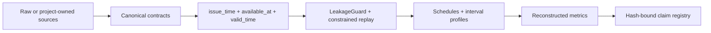

# ClimaDC

[简体中文](README.zh-CN.md)

ClimaDC is an **offline evaluation and replay framework for climate-aware data-center decisions
with causal time semantics and auditable evidence chains**. It validates what was knowable at a
decision time, compares constrained counterfactual schedules, and publishes independently
verifiable evidence. It is not an online controller, Kubernetes scheduler, RL framework, digital
twin, monitoring dashboard, or model repository.

## Quickstart

ClimaDC v0.3 Alpha supports Python 3.10–3.13. Install the published Alpha with
`python -m pip install "climadc==0.3.0a1"`, or install a checkout with
`python -m pip install -e .`.

```bash
export CLIMADC_STUDY="$(mktemp -d)/climadc-quickstart"
climadc init "$CLIMADC_STUDY"
climadc validate "$CLIMADC_STUDY/study.yaml"
climadc benchmark "$CLIMADC_STUDY/study.yaml"
climadc verify-run "$CLIMADC_STUDY/runs/latest"
climadc report "$CLIMADC_STUDY/runs/latest"
```

The quickstart is deterministic, synthetic, and offline. Published directories follow a
[versioned artifact contract](docs/evidence-model.md), rather than a permanent file-count promise.
Schema v2 adds `run-manifest.json`, `environment.json`, and recursive `checksums.sha256` integrity.

## Causal and evidence boundary



Candidate decisions may consume only rows available at their decision origin. Forecast,
estimated settlement, and measured observation are distinct qualities. National-average carbon
settlement is reported as `estimated_location_based_emissions_kgco2e`; it is not marginal avoided
emissions. See the [time-semantics guide](docs/concepts/time-semantics.md),
[evidence model](docs/evidence-model.md), and [evidence levels](docs/benchmark-evidence-levels.md).

## Evidence currently in the repository

### E0 — synthetic pipeline sanity check

The WeatherDC small fixture is project-generated CC0 data, not Kasetsart operational data.

| Synthetic cooling-power path | MAE (kW) | RMSE (kW) | WAPE |
|---|---:|---:|---:|
| Weather-aware OLS sanity check | 0.000000321 | 0.000000409 | 0.00000000475 |
| Legal persistence baseline | 4.210890 | 4.734545 | 0.062283 |

These numbers are deliberately labelled a **synthetic pipeline sanity check** and are bound to
claim [`E0-WEATHERDC-SANITY-001`](evidence/claims.yaml). They show fixture plumbing and causal
checks, not operational model accuracy, readiness, or savings. Full WeatherDC mode remains verified
conversion-only because the source provides observations without historical forecast vintages or
workload/control records.

### E1 — London 24-hour mechanism demonstration

```bash
climadc demo carbon-shift --output-dir ./climadc-replay-runs
climadc verify-run ./climadc-replay-runs/latest
climadc report ./climadc-replay-runs/latest
python benchmarks/reference/gb_london_24h/reproduce.py --check
```

The fixture uses external Open-Meteo/NESO-derived signals with a synthetic workload, declared UTC
tariff, illustrative carbon price, and reference PUE model. For example, the price policy changes
declared-scenario cost by **−28.3185 GBP** and estimated location-based emissions by
**+41.78469375 kgCO2e** versus ASAP
([`E1-LONDON-TRADEOFF-001`](evidence/claims.yaml)). This is a one-day trade-off demonstration—not
production savings, robustness validation, or same-site operational evidence.

Fresh network refreshes preserve exact response bytes under `raw/` and record safe request/status,
parser, license, and raw→canonical hashes. The historical checked-in fixture predates raw capture;
ClimaDC does not fabricate missing provider bytes.

## Replay objectives and sensitivity analysis

The preferred versioned objective is dimensionally explicit:

```yaml
replay:
  objective:
    version: "1"
    mode: monetized
    carbon_price_currency_per_tco2e: 1000
    demand_charge_per_kw: 0
```

`epsilon_constraint` minimizes declared cost subject to emissions and/or peak bounds.
`pareto_analysis` evaluates every fixed carbon-price point and reports the complete frontier without
selecting a preferred outcome. Legacy `cost_weight` / `carbon_weight` files retain their old,
dimensionally unscaled meaning, emit a deprecation warning, and are not presented as monetary
utility.

The packaged four-scenario matrix changes only objective/demand-charge assumptions on the same day
and workload, so it is **sensitivity analysis**:

```bash
climadc demo sensitivity-suite --output-dir ./climadc-replay-suite-runs
climadc verify-suite ./climadc-replay-suite-runs/latest
```

`climadc demo robustness-suite` remains a deprecated compatibility alias. A robustness claim needs
independent dates, seasons, locations, or workload samples with suitable provenance.

## Scope

ClimaDC includes canonical climate/DC/grid/workload contracts, local CSV/Parquet and optional Xarray
conversion, leakage-aware temporal evaluation, lightweight baselines, calibration, constrained
single-window/rolling replay, read-only source adapters, self-contained reports, and schema v2
verification. Prometheus/Kepler, Carbon Aware SDK-compatible, and SustainDC paths are read-only;
they do not deploy or control upstream systems.

No current artifact reaches E2 trace-driven causal benchmarking or E3 same-site operational
validation. Those remain `DATA_REQUIRED`, with gates documented in
[benchmark evidence levels](docs/benchmark-evidence-levels.md).

## Documentation and project policy

- [Quickstart](docs/quickstart.md)
- [Replay kernel and objective migration](docs/concepts/replay-kernel.md)
- [Sensitivity suites](docs/concepts/robustness-suites.md)
- [London reference replay](docs/concepts/reference-replay.md)
- [API stability](docs/api-stability.md) and [API reference](docs/api/index.md)
- [Roadmap](ROADMAP.md), [governance](GOVERNANCE.md), [maintainers](MAINTAINERS.md), and
  [support](SUPPORT.md)

ClimaDC uses Apache-2.0. Upstream data and services retain their own terms. The software citation
version is `0.3.0-alpha.1` (PEP 440: `0.3.0a1`); see [CITATION.cff](CITATION.cff).
