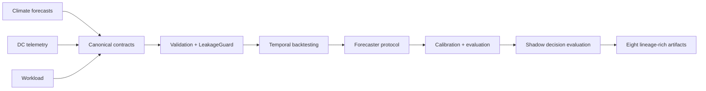

# ClimaDC

[简体中文](README.zh-CN.md)

ClimaDC is a leakage-aware, contract-first framework for climate-aware data-center forecasting and shadow decision evaluation.

## Quickstart

Prerequisites: Python 3.10-3.13 and a POSIX-compatible shell (Bash or Zsh). Install the Alpha from a checkout with `python -m pip install -e .`; after publication, use `python -m pip install "climadc==0.1.0a1"`. The five commands below create only deterministic synthetic data and do not use the network.

```bash
export CLIMADC_STUDY="$(mktemp -d)/climadc-quickstart"
climadc init "$CLIMADC_STUDY"
climadc validate "$CLIMADC_STUDY/study.yaml"
climadc benchmark "$CLIMADC_STUDY/study.yaml"
climadc report "$CLIMADC_STUDY/runs/latest"
```

The published run contains exactly eight auditable artifacts: configuration, lineage, splits, predictions, metrics, leakage audit, dataset cards, and a static HTML report. See the [Quickstart guide](docs/quickstart.md) for Windows PowerShell commands and artifact details.

## Architecture



The framework owns domain contracts, decision-time availability semantics, leakage-aware alignment, benchmark orchestration, and offline decision comparison. It does not reimplement weather foundation models, general time-series libraries, telemetry collectors, or data-center simulators.

## Reproducible synthetic result

The table below was reproduced on 2026-07-11 with `python examples/weatherdc_kasetsart/run.py --small`. It uses only the checked-in, project-generated CC0 fixture—not Kasetsart operational data.

| Synthetic cooling-power model | MAE (kW) | RMSE (kW) | WAPE |
|---|---:|---:|---:|
| Weather-aware OLS reference | 0.000000321 | 0.000000409 | 0.00000000475 |
| Legal persistence | 4.210890 | 4.734545 | 0.062283 |

The same run accepted 240 climate rows, rejected 0 rows in its leakage audit, and reported zero scheduler energy-conservation error. These fixture results verify framework plumbing and causality checks only. They are not evidence of operational accuracy, production readiness, or energy savings. See the [WeatherDC reference study](examples/weatherdc_kasetsart/README.md).

WeatherDC full mode is verified conversion-only: upstream HII rows are observations, and the available sources do not provide workload or control data. This Alpha did not run or claim a full WeatherDC retraining result.

## Scope and non-goals

Alpha includes:

- canonical climate forecast, DC telemetry, workload, and prediction contracts;
- `available_at`-based leakage auditing and blocked/rolling-origin splits;
- lightweight baselines, conformal calibration, evaluation slices, and an energy-conserving shadow scheduler;
- local CSV/Parquet, optional Xarray, Open-Meteo, and WeatherDC adapters;
- a CLI and deterministic HTML/JSON/Markdown/Parquet run artifacts.

Alpha does not include online inference, automatic data-center control, a web dashboard, Kubernetes scheduling, reinforcement learning, a physical digital twin, or a model zoo. APIs may change before a stable release.

## Integrations and extension points

Implemented inputs are local CSV/Parquet, optional Xarray conversion, Open-Meteo forecasts, and verified WeatherDC source conversion. User models, calibrators, and decision policies connect through the public protocols. Darts, NeuralForecast, Earth2Studio, Kepler, SustainDC, and Carbon-Aware SDK are ecosystem boundaries, not implemented Alpha integrations.

## Documentation

- [Quickstart](docs/quickstart.md)
- [Time semantics: `issue_time`, `available_at`, `valid_time`](docs/concepts/time-semantics.md)
- [WeatherDC reference study](examples/weatherdc_kasetsart/README.md)
- [Contributing](CONTRIBUTING.md) and [security policy](SECURITY.md)

The documentation site can be checked locally with `mkdocs build --strict`.

## Citation

ClimaDC Alpha uses the software citation version `0.1.0-alpha.1`; the Python package version is the PEP 440 equivalent `0.1.0a1`. Cite the repository metadata in [CITATION.cff](CITATION.cff).

## License

ClimaDC code is licensed under Apache-2.0. Upstream data, model weights, and external services retain their own terms and are not relicensed by this repository.
