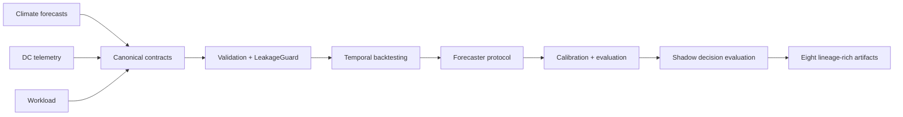

# ClimaDC

[简体中文](README.zh-CN.md)

ClimaDC is a leakage-aware, contract-first framework for climate-aware data-center forecasting and shadow decision evaluation.

## Quickstart

Prerequisites: Python 3.10-3.13 and a POSIX-compatible shell (Bash or Zsh). Install the Alpha from a checkout with `python -m pip install -e .`; after publication, use `python -m pip install "climadc==0.2.0a1"`. The five commands below create only deterministic synthetic data and do not use the network.

```bash
export CLIMADC_STUDY="$(mktemp -d)/climadc-quickstart"
climadc init "$CLIMADC_STUDY"
climadc validate "$CLIMADC_STUDY/study.yaml"
climadc benchmark "$CLIMADC_STUDY/study.yaml"
climadc report "$CLIMADC_STUDY/runs/latest"
```

The published run contains exactly eight auditable artifacts: configuration, lineage, splits, predictions, metrics, leakage audit, dataset cards, and a static HTML report. See the [Quickstart guide](docs/quickstart.md) for Windows PowerShell commands and artifact details.

## Architecture



The framework owns domain contracts, decision-time availability semantics, leakage-aware alignment, benchmark orchestration, and offline decision comparison. It does not reimplement weather foundation models, general time-series libraries, telemetry collectors, or data-center simulators.

## Reproducible synthetic result

The table below was reproduced on 2026-07-11 with `python examples/weatherdc_kasetsart/run.py --small`. It uses only the checked-in, project-generated CC0 fixture—not Kasetsart operational data.

| Synthetic cooling-power model | MAE (kW) | RMSE (kW) | WAPE |
|---|---:|---:|---:|
| Weather-aware OLS reference | 0.000000321 | 0.000000409 | 0.00000000475 |
| Legal persistence | 4.210890 | 4.734545 | 0.062283 |

The same run accepted 240 climate rows, rejected 0 rows in its leakage audit, and reported zero scheduler energy-conservation error. These fixture results verify framework plumbing and causality checks only. They are not evidence of operational accuracy, production readiness, or energy savings. See the [WeatherDC reference study](examples/weatherdc_kasetsart/README.md).

WeatherDC full mode is verified conversion-only: upstream HII rows are observations, and the available sources do not provide workload or control data. This Alpha did not run or claim a full WeatherDC retraining result.

## v0.2 Alpha engineering replay

The v0.2 Alpha adds backward-compatible single-window and rolling engineering
replay:

- `GridSignalFrame` separates forecast and realized carbon intensity or energy price, including causal timestamps and signal-specific units;
- `FlexibleWorkloadFrame` represents preemptible jobs with release, availability, deadline, energy, maximum-power, and priority fields.
- `ReplayEngine` compares ASAP, peak, price, carbon, joint, and realized-value Oracle schedules
  under the same capacity and deadline constraints, with an optional upper-quantile joint policy;
- realized settlement reports facility/IT/cooling energy, emissions, scenario cost and demand charge, peak, SLA outcomes, shifted energy, and Oracle regret.

Local CSV/Parquet readers are available for both contracts, and a calibrated facility model can
replace the bounded temperature-sensitive PUE reference through a public protocol. See the
[replay-kernel guide](docs/concepts/replay-kernel.md) and
[v0.2 design](docs/design/v0.2-engineering-replay.md).

Phase 2 now adds a complete 24-hour Great Britain reference replay. Run it offline from any
directory after installation:

```bash
climadc demo carbon-shift --output-dir ./climadc-replay-runs
climadc report ./climadc-replay-runs/latest
```

The run compares all six policies and publishes 12 hash-bound, reconstructible artifacts including
canonical inputs, schedules, interval profiles, metrics, solver status, source lineage, and a
self-contained HTML report. Its weather and carbon snapshots come from Open-Meteo and the official
NESO API; the historical forecast availability timestamps, tariff, workload, and facility model are
explicit scenario assumptions. Weather settlement is gridded estimated data and carbon settlement
is a national estimated value—not site telemetry. This is an engineering replay demonstration, not
a production-savings claim. See the [Great Britain reference replay](docs/concepts/reference-replay.md).

Phase 3 adds optional read-only adapters for Prometheus/Kepler power telemetry, Carbon Aware
SDK-compatible grid responses, and SustainDC evaluation exports. They preserve causal availability
and source quality without deploying collectors, importing simulator runtimes, or calling control
endpoints. See the [read-only integration guide](docs/concepts/read-only-integrations.md).

Phase 4 adds receding-horizon orchestration and an optional upper-quantile joint policy. A rolling
study re-solves the full horizon at each origin, commits only the configured step, and carries each
policy's remaining job energy forward. Setting `replay.risk_quantile` adds a seventh policy only
when exact, causally available temperature, price, and carbon quantiles exist for every slot; there
is no silent point-forecast fallback. This declared scenario is not CVaR, calibrated interval
coverage, or a production guarantee. Configuration and limits are documented in the
[replay-kernel guide](docs/concepts/replay-kernel.md).

Phase 5 makes that declared risk scenario auditable after settlement. Risk-enabled single-window
and rolling runs now backtest each marginal quantile over the slots actually committed, publishing
empirical coverage, a 95% Wilson interval, coverage gap, exceedance magnitudes, and pinball loss in
`replay-metrics.json` and the self-contained report. These descriptive checks do not establish joint
coverage or recalibrate the schedule.

Phase 6 adds reproducible multi-scenario robustness studies. `climadc replay-suite` runs two or
more complete replay configurations, preserves every scenario's 12-artifact evidence record, and
publishes feasibility rates, equal-weight mean and worst signed changes from each scenario's ASAP
baseline, plus a three-objective Pareto frontier for policies feasible everywhere. The packaged
offline demo varies objective weights and a synthetic demand charge:

```bash
climadc demo robustness-suite --output-dir ./climadc-replay-suite-runs
climadc report ./climadc-replay-suite-runs/latest
```

Equal scenario weights are not probabilities, and the finite declared worst case is not a tail-risk
guarantee. See the [replay robustness suite guide](docs/concepts/robustness-suites.md).

## Scope and non-goals

The v0.2 Alpha includes:

- canonical climate forecast, DC telemetry, workload, and prediction contracts;
- `available_at`-based leakage auditing and blocked/rolling-origin splits;
- lightweight baselines, conformal calibration, evaluation slices, and an energy-conserving shadow scheduler;
- local CSV/Parquet, optional Xarray, current and historical Open-Meteo, NESO Carbon Intensity,
  WeatherDC, Prometheus/Kepler, Carbon Aware SDK-compatible, and SustainDC adapters;
- a CLI and deterministic HTML/JSON/Markdown/Parquet run artifacts.

Alpha does not include online inference, automatic data-center control, a web dashboard, Kubernetes scheduling, reinforcement learning, a physical digital twin, or a model zoo. APIs may change before a stable release.

## Integrations and extension points

Implemented inputs in this checkout are local CSV/Parquet, optional Xarray conversion, current and
historical Open-Meteo weather, NESO national carbon intensity, and verified WeatherDC source
conversion. Read-only Prometheus/Kepler, Carbon Aware SDK-compatible, and SustainDC evaluation
adapters are also implemented without vendoring those platforms. User models, calibrators, and
decision policies connect through the public protocols. Darts, NeuralForecast, and Earth2Studio
remain ecosystem boundaries rather than implemented integrations.

## Documentation

- [Quickstart](docs/quickstart.md)
- [Time semantics: `issue_time`, `available_at`, `valid_time`](docs/concepts/time-semantics.md)
- [Engineering input contracts](docs/concepts/engineering-inputs.md)
- [Engineering replay kernel](docs/concepts/replay-kernel.md)
- [Replay robustness suites](docs/concepts/robustness-suites.md)
- [Great Britain reference replay](docs/concepts/reference-replay.md)
- [Read-only integration adapters](docs/concepts/read-only-integrations.md)
- [v0.2 engineering replay design](docs/design/v0.2-engineering-replay.md)
- [WeatherDC reference study](examples/weatherdc_kasetsart/README.md)
- [Contributing](CONTRIBUTING.md) and [security policy](SECURITY.md)

The documentation site can be checked locally with `mkdocs build --strict`.

## Citation

ClimaDC Alpha uses the software citation version `0.2.0-alpha.1`; the Python package version is the PEP 440 equivalent `0.2.0a1`. Cite the repository metadata in [CITATION.cff](CITATION.cff).

## License

ClimaDC code is licensed under Apache-2.0. Upstream data, model weights, and external services retain their own terms and are not relicensed by this repository.
