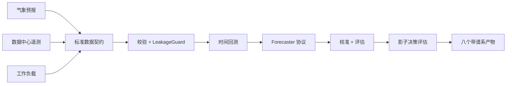

# ClimaDC

[English](README.md)

ClimaDC 是一个防信息泄漏、契约优先的框架，用于气候感知的数据中心预测与影子决策评估。

## 快速开始

前置条件：Python 3.10-3.13，以及兼容 POSIX 的 Shell（Bash 或 Zsh）。从源码检出安装 Alpha：`python -m pip install -e .`；发布后可使用 `python -m pip install "climadc==0.1.0a1"`。下面五条命令只生成确定性合成数据，不访问网络。

```bash
export CLIMADC_STUDY="$(mktemp -d)/climadc-quickstart"
climadc init "$CLIMADC_STUDY"
climadc validate "$CLIMADC_STUDY/study.yaml"
climadc benchmark "$CLIMADC_STUDY/study.yaml"
climadc report "$CLIMADC_STUDY/runs/latest"
```

发布后的每次运行恰好包含八个可审计产物：配置、谱系、拆分、预测、指标、泄漏审计、数据卡和静态 HTML 报告。Windows PowerShell 命令与产物说明见[快速开始指南](docs/zh-CN/quickstart.md)。

## 架构



框架负责领域契约、决策时刻可用性语义、防泄漏对齐、Benchmark 编排和离线决策对比。它不重复实现气象基础模型、通用时序库、遥测采集器或数据中心仿真器。

## 可复现的合成结果

下表于 2026-07-11 通过 `python examples/weatherdc_kasetsart/run.py --small` 复现。它只使用仓库内项目生成的 CC0 fixture，不使用 Kasetsart 运营数据。

| 合成冷却功率模型 | MAE (kW) | RMSE (kW) | WAPE |
|---|---:|---:|---:|
| 气象感知 OLS 参考模型 | 0.000000321 | 0.000000409 | 0.00000000475 |
| 合法持久性基线 | 4.210890 | 4.734545 | 0.062283 |

同一次运行的泄漏审计接受 240 行气象数据、拒绝 0 行，调度器能量守恒误差为零。这些 fixture 结果只验证框架链路和因果检查，不代表运营精度、生产可用性或节能效果。详见 [WeatherDC 参考研究](examples/weatherdc_kasetsart/README.md)。

WeatherDC 完整模式仅完成经过校验的数据转换：上游 HII 行是观测，现有数据源也没有提供工作负载或控制数据。本 Alpha 没有运行或宣称完整 WeatherDC 重训练结果。

## 范围与非目标

Alpha 包含：

- 标准气象预报、数据中心遥测、工作负载和预测契约；
- 基于 `available_at` 的泄漏审计，以及 blocked/rolling-origin 拆分；
- 轻量基线、共形校准、评估切片和能量守恒影子调度器；
- 本地 CSV/Parquet、可选 Xarray、Open-Meteo 与 WeatherDC 适配器；
- CLI，以及确定性的 HTML/JSON/Markdown/Parquet 运行产物。

Alpha 不包含在线推理、真实数据中心自动控制、Web Dashboard、Kubernetes 调度、强化学习、物理数字孪生或模型动物园。稳定版本前 API 可能调整。

## 集成与扩展边界

已实现输入包括本地 CSV/Parquet、可选 Xarray 转换、Open-Meteo 预报和经过校验的 WeatherDC 源数据转换。用户模型、校准器和决策策略通过公开协议接入。Darts、NeuralForecast、Earth2Studio、Kepler、SustainDC 与 Carbon-Aware SDK 是生态边界，不是 Alpha 已实现的集成。

## 文档

- [快速开始](docs/zh-CN/quickstart.md)
- [时间语义：`issue_time`、`available_at`、`valid_time`](docs/zh-CN/concepts/time-semantics.md)
- [WeatherDC 参考研究](examples/weatherdc_kasetsart/README.md)
- [贡献指南](CONTRIBUTING.md)与[安全政策](SECURITY.md)

可使用 `mkdocs build --strict` 在本地检查文档站点。

## 引用

ClimaDC Alpha 的软件引用版本为 `0.1.0-alpha.1`，对应 Python 包的 PEP 440 版本 `0.1.0a1`。请使用 [CITATION.cff](CITATION.cff) 中的仓库元数据引用。

## 许可证

ClimaDC 代码采用 Apache-2.0 许可。上游数据、模型权重和外部服务仍遵循各自条款，本仓库不对它们重新许可。
