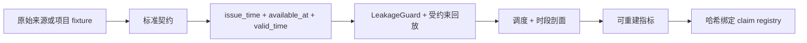

# ClimaDC

[English](README.md)

ClimaDC 是一个**面向气候感知数据中心决策、具备因果时间语义和可审计证据链的离线
评测与回放框架**。它校验决策时刻真正可知的信息、比较受约束的反事实调度，并发布可
独立验证的证据。它不是在线控制器、Kubernetes 调度器、RL 框架、数字孪生、监控
Dashboard 或大型模型仓库。

## 快速开始

v0.3 Alpha 支持 Python 3.10–3.13。从源码检出安装：`python -m pip install -e .`；经授权
发布后的包版本将是 `climadc==0.3.0a1`。

```bash
export CLIMADC_STUDY="$(mktemp -d)/climadc-quickstart"
climadc init "$CLIMADC_STUDY"
climadc validate "$CLIMADC_STUDY/study.yaml"
climadc benchmark "$CLIMADC_STUDY/study.yaml"
climadc verify-run "$CLIMADC_STUDY/runs/latest"
climadc report "$CLIMADC_STUDY/runs/latest"
```

该快速开始只使用确定性合成数据且不访问网络。运行目录遵循[版本化产物契约](docs/evidence-model.md)，
不再把固定文件数当作长期 API。schema v2 新增 `run-manifest.json`、`environment.json` 与
递归 `checksums.sha256`。

## 因果与证据边界



候选决策只能消费在决策起点已经可用的行。forecast、estimated settlement 与 measured
observation 是不同质量。全国平均碳强度结算统一命名为
`estimated_location_based_emissions_kgco2e`，不代表边际避免排放。详见[时间语义](docs/zh-CN/concepts/time-semantics.md)、
[证据模型](docs/evidence-model.md)与[证据等级](docs/benchmark-evidence-levels.md)。

## 当前证据

### E0 — 合成链路健全性检查

WeatherDC small fixture 是项目生成的 CC0 数据，不是 Kasetsart 运营数据。

| 合成冷却功率路径 | MAE (kW) | RMSE (kW) | WAPE |
|---|---:|---:|---:|
| 气象感知 OLS 链路检查 | 0.000000321 | 0.000000409 | 0.00000000475 |
| 合法持久性基线 | 4.210890 | 4.734545 | 0.062283 |

这些数值只称为 **synthetic pipeline sanity check**，并绑定 claim
[`E0-WEATHERDC-SANITY-001`](evidence/claims.yaml)。它们不证明运营数据精度、生产可用性或
节能。WeatherDC full 仍只做经过校验的转换，因为上游没有历史预报版本、工作负载或控制记录。

### E1 — 伦敦 24 小时机制演示

```bash
climadc demo carbon-shift --output-dir ./climadc-replay-runs
climadc verify-run ./climadc-replay-runs/latest
python benchmarks/reference/gb_london_24h/reproduce.py --check
```

该 fixture 使用 Open-Meteo/NESO 衍生外部信号，以及合成工作负载、明确的 UTC 电价场景、
示意碳价和参考 PUE 模型。例如，低价策略相对 ASAP 的声明场景成本变化为 **−28.3185 GBP**，
估算位置法排放变化为 **+41.78469375 kgCO2e**
（[`E1-LONDON-TRADEOFF-001`](evidence/claims.yaml)）。这只是单日权衡演示，不是生产节省、
稳健性验证或同站点运营证据。

新的网络刷新会在解析前保存 `raw/` 原始响应字节，并记录安全请求字段、HTTP 状态、解析器、
许可和 raw→canonical 哈希。仓库内历史 fixture 早于该契约，缺失的原始响应不会被伪造。

## 目标函数与敏感性分析

推荐使用版本化、量纲明确的 `monetized`、`epsilon_constraint` 或 `pareto_analysis` 目标。
Pareto 模式会输出所有预先声明的碳价点，不挑选“最好”的结果。旧
`cost_weight` / `carbon_weight` 保留原语义，但会发出弃用警告并标记为
`legacy_unscaled`，不得解释为货币收益或统一效用。

内置四场景只在同一日期和工作负载上改变目标/需量费，因此是**敏感性分析**：

```bash
climadc demo sensitivity-suite --output-dir ./climadc-replay-suite-runs
climadc verify-suite ./climadc-replay-suite-runs/latest
```

`climadc demo robustness-suite` 仅作为带弃用提示的兼容别名保留。真正的稳健性声明需要独立
日期、季节、位置或工作负载样本与相应来源证据。

## 范围与文档

已实现标准气象/DC/电网/负载契约、本地 CSV/Parquet、可选 Xarray、防泄漏时间评测、轻量
基线、校准、单窗口/滚动受约束回放、只读适配器、自包含报告和 schema v2 验证。可选
Prometheus/Kepler、Carbon Aware SDK 兼容与 SustainDC 路径都不会部署或控制上游系统。

当前没有 E2 trace-driven causal benchmark 或 E3 同站点运营验证；它们仍是
`DATA_REQUIRED`。参阅[快速开始](docs/zh-CN/quickstart.md)、[回放内核](docs/zh-CN/concepts/replay-kernel.md)、
[敏感性套件](docs/zh-CN/concepts/robustness-suites.md)、[参考回放](docs/zh-CN/concepts/reference-replay.md)、
[API 稳定性](docs/api-stability.md)与[路线图](ROADMAP.md)。

ClimaDC 代码采用 Apache-2.0，上游数据与服务保留各自条款。软件引用版本为
`0.3.0-alpha.1`（PEP 440：`0.3.0a1`），见 [CITATION.cff](CITATION.cff)。本次变更不会发布
PyPI 或 GitHub Release。
