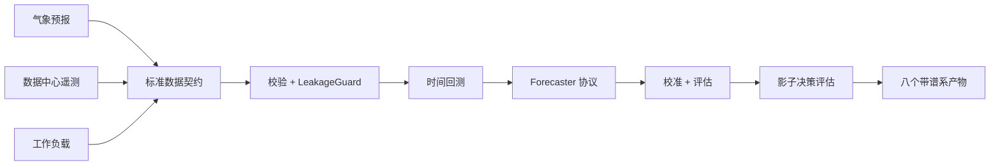

# ClimaDC

[English](README.md)

ClimaDC 是一个防信息泄漏、契约优先的框架，用于气候感知的数据中心预测与影子决策评估。

## 快速开始

前置条件：Python 3.10-3.13，以及兼容 POSIX 的 Shell（Bash 或 Zsh）。从源码检出安装 Alpha：`python -m pip install -e .`；发布后可使用 `python -m pip install "climadc==0.1.0a1"`。下面五条命令只生成确定性合成数据，不访问网络。

```bash
export CLIMADC_STUDY="$(mktemp -d)/climadc-quickstart"
climadc init "$CLIMADC_STUDY"
climadc validate "$CLIMADC_STUDY/study.yaml"
climadc benchmark "$CLIMADC_STUDY/study.yaml"
climadc report "$CLIMADC_STUDY/runs/latest"
```

发布后的每次运行恰好包含八个可审计产物：配置、谱系、拆分、预测、指标、泄漏审计、数据卡和静态 HTML 报告。Windows PowerShell 命令与产物说明见[快速开始指南](docs/zh-CN/quickstart.md)。

## 架构



框架负责领域契约、决策时刻可用性语义、防泄漏对齐、Benchmark 编排和离线决策对比。它不重复实现气象基础模型、通用时序库、遥测采集器或数据中心仿真器。

## 可复现的合成结果

下表于 2026-07-11 通过 `python examples/weatherdc_kasetsart/run.py --small` 复现。它只使用仓库内项目生成的 CC0 fixture，不使用 Kasetsart 运营数据。

| 合成冷却功率模型 | MAE (kW) | RMSE (kW) | WAPE |
|---|---:|---:|---:|
| 气象感知 OLS 参考模型 | 0.000000321 | 0.000000409 | 0.00000000475 |
| 合法持久性基线 | 4.210890 | 4.734545 | 0.062283 |

同一次运行的泄漏审计接受 240 行气象数据、拒绝 0 行，调度器能量守恒误差为零。这些 fixture 结果只验证框架链路和因果检查，不代表运营精度、生产可用性或节能效果。详见 [WeatherDC 参考研究](examples/weatherdc_kasetsart/README.md)。

WeatherDC 完整模式仅完成经过校验的数据转换：上游 HII 行是观测，现有数据源也没有提供工作负载或控制数据。本 Alpha 没有运行或宣称完整 WeatherDC 重训练结果。

## 尚未发布的 v0.2 工程回放

当前开发版本以向后兼容方式新增单窗口与滚动工程回放能力：

- `GridSignalFrame` 分离碳强度或电价的预测值与事后值，并校验因果时间和信号专属单位；
- `FlexibleWorkloadFrame` 使用释放、可用、截止、能量、最大功率和优先级描述可抢占任务。
- `ReplayEngine` 在同一套容量和截止约束下比较 ASAP、削峰、低价、低碳、联合目标和事后 Oracle，并可选增加上分位数联合策略；
- 事后结算输出站点/IT/冷却能耗、碳排、场景电费与需量费用、峰值、SLA、转移能量和 Oracle 后悔值。

两个契约都已提供本地 CSV/Parquet 读取器，并可通过公开协议用站点标定模型替换有界的温度敏感 PUE 参考模型。

阶段 2 现已加入完整的 24 小时英国参考回放。安装后可以从任意目录完全离线运行：

```bash
climadc demo carbon-shift --output-dir ./climadc-replay-runs
climadc report ./climadc-replay-runs/latest
```

运行会比较六种策略，并发布 12 个带哈希、可重建的产物，包括标准输入、调度、逐时段剖面、指标、求解器状态、来源谱系和自包含 HTML 报告。天气和碳快照来自 Open-Meteo 与官方 NESO API；历史预报可用时间、电价、负载和站点模型均明确标为场景假设。天气结算是网格化估算，碳结算是英国全国估算值，都不是站点实测遥测。因此它是工程回放演示，不是真实生产节能声明。详见[英国参考回放案例](docs/zh-CN/concepts/reference-replay.md)。

阶段 3 新增 Prometheus/Kepler 功率遥测、Carbon Aware SDK 兼容电网响应和 SustainDC 评估导出的可选只读适配器。它们保留因果可用时间和来源质量，但不部署采集器、不引入仿真运行时，也不调用控制接口。详见[只读生态适配器](docs/zh-CN/concepts/read-only-integrations.md)。

阶段 4 新增滚动时域编排和可选的上分位数联合策略。滚动研究会在每个决策点重算完整时域，只提交配置的步长，并按策略分别结转任务剩余能量。设置 `replay.risk_quantile` 后，只有温度、电价、碳强度在每个时段都存在精确且因果可用的同一分位数时，才会加入第七种策略；不会静默退回点预测。这个声明场景不是 CVaR、经过校准的区间覆盖率或生产保证。配置与限制见[工程回放内核](docs/zh-CN/concepts/replay-kernel.md)，完整边界见 [v0.2 工程回放技术设计](docs/zh-CN/design/v0.2-engineering-replay.md)。

阶段 5 让声明的风险场景在事后结算后可审计。启用风险策略的单窗口和滚动运行会针对实际提交时段分别回测三个边际分位数，并在 `replay-metrics.json` 与自包含报告中发布经验覆盖率、95% Wilson 区间、覆盖差、超越幅度和 pinball loss。这些描述性检查不代表联合覆盖保证，也不会用事后结果重新校准调度。

阶段 6 新增可复现的多场景稳健性研究。`climadc replay-suite` 会运行至少两份完整回放配置，保留每个场景的 12 项证据记录，并发布可行率、相对各场景 ASAP 基线的等权平均与最坏有符号变化，以及只面向全场景可行策略的三目标 Pareto 前沿。打包的离线示例会改变目标权重和一个合成需量费用：

```bash
climadc demo robustness-suite --output-dir ./climadc-replay-suite-runs
climadc report ./climadc-replay-suite-runs/latest
```

等权场景不是发生概率，有限声明场景中的最坏值也不是尾部风险保证。详见[回放稳健性套件](docs/zh-CN/concepts/robustness-suites.md)。

## 范围与非目标

当前开发版本包含：

- 标准气象预报、数据中心遥测、工作负载和预测契约；
- 基于 `available_at` 的泄漏审计，以及 blocked/rolling-origin 拆分；
- 轻量基线、共形校准、评估切片和能量守恒影子调度器；
- 本地 CSV/Parquet、可选 Xarray、当前/历史 Open-Meteo、NESO Carbon Intensity、WeatherDC、
  Prometheus/Kepler、Carbon Aware SDK 兼容和 SustainDC 适配器；
- CLI，以及确定性的 HTML/JSON/Markdown/Parquet 运行产物。

Alpha 不包含在线推理、真实数据中心自动控制、Web Dashboard、Kubernetes 调度、强化学习、物理数字孪生或模型动物园。稳定版本前 API 可能调整。

## 集成与扩展边界

当前开发版本已实现本地 CSV/Parquet、可选 Xarray 转换、Open-Meteo 当前/历史天气、NESO
英国全国碳强度，以及经过校验的 WeatherDC 源数据转换；还实现了不内置上游平台的 Prometheus/Kepler、Carbon Aware SDK 兼容与 SustainDC 评估只读适配器。用户模型、校准器和决策策略通过公开协议接入。Darts、NeuralForecast 与 Earth2Studio 仍是生态边界，不是已实现集成。

## 文档

- [快速开始](docs/zh-CN/quickstart.md)
- [时间语义：`issue_time`、`available_at`、`valid_time`](docs/zh-CN/concepts/time-semantics.md)
- [工程输入契约](docs/zh-CN/concepts/engineering-inputs.md)
- [工程回放内核](docs/zh-CN/concepts/replay-kernel.md)
- [回放稳健性套件](docs/zh-CN/concepts/robustness-suites.md)
- [英国参考回放案例](docs/zh-CN/concepts/reference-replay.md)
- [只读生态适配器](docs/zh-CN/concepts/read-only-integrations.md)
- [v0.2 工程回放技术设计](docs/zh-CN/design/v0.2-engineering-replay.md)
- [WeatherDC 参考研究](examples/weatherdc_kasetsart/README.md)
- [贡献指南](CONTRIBUTING.md)与[安全政策](SECURITY.md)

可使用 `mkdocs build --strict` 在本地检查文档站点。

## 引用

ClimaDC Alpha 的软件引用版本为 `0.1.0-alpha.1`，对应 Python 包的 PEP 440 版本 `0.1.0a1`。请使用 [CITATION.cff](CITATION.cff) 中的仓库元数据引用。

## 许可证

ClimaDC 代码采用 Apache-2.0 许可。上游数据、模型权重和外部服务仍遵循各自条款，本仓库不对它们重新许可。
