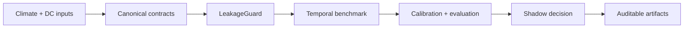

# ClimaDC

ClimaDC is a leakage-aware, contract-first framework for climate-aware data-center forecasting and shadow decision evaluation.

Use it to validate climate/DC time semantics, run temporal baselines, calibrate uncertainty, compare an energy-conserving shadow decision policy, and publish an eight-file research record. The Alpha is an offline research framework—not an online controller or a claim of production energy savings.

Start with the [five-command Quickstart](quickstart.md), then read the [`issue_time` / `available_at` / `valid_time` guide](concepts/time-semantics.md). The [WeatherDC example](https://github.com/Hai-qq/climadc/tree/main/examples/weatherdc_kasetsart) separates a fully offline synthetic benchmark from verified upstream conversion-only mode.

The unreleased development checkout also includes the [v0.2 engineering replay](design/v0.2-engineering-replay.md): strict grid-signal and flexible-workload contracts, local readers, six default constrained policies plus an optional upper-quantile policy, single-window or rolling execution, realized-value settlement with post-hoc committed-slot marginal risk diagnostics, [multi-scenario robustness/Pareto suites](concepts/robustness-suites.md), a complete [Great Britain reference replay](concepts/reference-replay.md), and [read-only Prometheus/Kepler, Carbon Aware SDK, and SustainDC adapters](concepts/read-only-integrations.md).

## Current boundary

Implemented adapters cover local CSV/Parquet, optional Xarray, current and historical Open-Meteo,
NESO national carbon intensity, and WeatherDC conversion. The full WeatherDC path converts HII
observations and meter data but does not fabricate historical forecast availability, workload,
control, or full retraining results. Optional ecosystem adapters consume exports and API responses;
they do not deploy, configure, or control those upstream systems.
