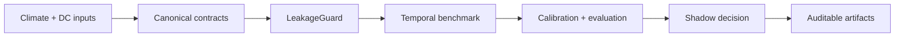

# ClimaDC

ClimaDC is an offline evaluation and replay framework for climate-aware data-center decisions with causal time semantics and auditable evidence chains.

Use it to validate climate/DC time semantics, run temporal baselines, compare constrained shadow decisions, and publish a versioned, independently verifiable evidence record. It is not an online controller or a claim of production energy savings.

Start with the [independently verified Quickstart](quickstart.md), then read the [`issue_time` / `available_at` / `valid_time` guide](concepts/time-semantics.md). The [WeatherDC example](https://github.com/Hai-qq/climadc/tree/main/examples/weatherdc_kasetsart) separates a fully offline synthetic benchmark from verified upstream conversion-only mode.

The v0.3 Alpha adds [independent artifact verification](evidence-model.md), [E0–E3 evidence levels](benchmark-evidence-levels.md), dimensionally explicit objectives, [sensitivity/robustness suite semantics](concepts/robustness-suites.md), a compact generated [Great Britain E1 reference replay](concepts/reference-replay.md), and read-only source adapters. Current evidence reaches E0 and E1 only.

## Current boundary

Implemented adapters cover local CSV/Parquet, optional Xarray, current and historical Open-Meteo,
NESO national carbon intensity, and WeatherDC conversion. The full WeatherDC path converts HII
observations and meter data but does not fabricate historical forecast availability, workload,
control, or full retraining results. Optional ecosystem adapters consume exports and API responses;
they do not deploy, configure, or control those upstream systems.
