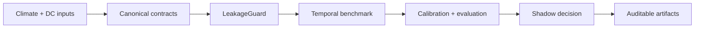

# ClimaDC

ClimaDC is a leakage-aware, contract-first framework for climate-aware data-center forecasting and shadow decision evaluation.

Use it to validate climate/DC time semantics, run temporal baselines, calibrate uncertainty, compare an energy-conserving shadow decision policy, and publish an eight-file research record. The Alpha is an offline research framework—not an online controller or a claim of production energy savings.

Start with the [five-command Quickstart](quickstart.md), then read the [`issue_time` / `available_at` / `valid_time` guide](concepts/time-semantics.md). The [WeatherDC example](https://github.com/Hai-qq/climadc/tree/main/examples/weatherdc_kasetsart) separates a fully offline synthetic benchmark from verified upstream conversion-only mode.

## Current boundary

Implemented adapters cover local CSV/Parquet, optional Xarray, Open-Meteo, and WeatherDC conversion. The full WeatherDC path converts HII observations and meter data but does not fabricate historical forecast availability, workload, control, or full retraining results.
