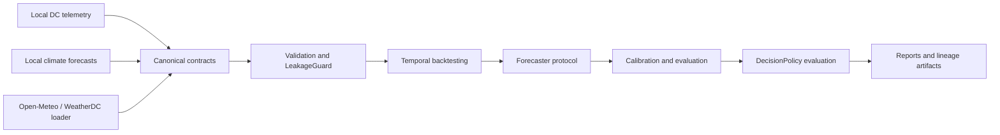

# ClimaDC 开源框架设计规范

- 日期：2026-07-10
- 状态：历史设计快照；现行能力与边界以 `README.md` 和
  `docs/design/v0.2-engineering-replay.md` 为准，不再作为待审事项
- 许可证：Apache License 2.0
- 计划仓库：`Hai-qq/climadc`
- 计划 Python 包：`climadc`
- 首个公开版本：`v0.1.0-alpha.1`

## 1. 背景

现有 `WeatherDC-MVP` 已经验证了一条可运行的研究链路：站点气象预测、数据中心冷却/总功率预测、概率区间校准和风险感知影子调度。但它仍是固定数据、固定目标和固定脚本驱动的单一实验，不能直接作为通用开发框架。

GitHub 生态中已有成熟项目分别覆盖通用时序预测、AI 气象、数据中心仿真、碳感知调度和能耗遥测。ClimaDC 不复制这些能力，而是提供它们之间缺失的领域连接层：标准气象预报与 DC 遥测契约、决策时刻可用性语义、防信息泄漏对齐、统一回测协议和预测到决策的离线价值评测。

## 2. 生态边界

| 领域 | 现有项目 | ClimaDC 的关系 |
|---|---|---|
| 数据中心仿真与控制 | SustainDC、SustainCluster | 后续提供适配器，不重建物理仿真器或 RL 环境 |
| 通用数据中心仿真 | OpenDC | 后续支持结果导入或实验互操作，不重建离散事件仿真 |
| 碳感知调度 | Carbon-Aware SDK、Impact Framework | 后续消费其碳强度与影响数据，不维护碳数据服务 |
| Kubernetes 能耗遥测 | Kepler | 后续通过 Prometheus/Kepler 适配器接入，不实现采集器 |
| 时序预测 | Darts、NeuralForecast | 通过 `Forecaster` 协议接入，不建立模型动物园 |
| 不确定性量化 | MAPIE、Darts conformal | 复用或适配成熟实现，ClimaDC 负责时间有效性和评测协议 |
| AI 气象 | Earth2Studio、ECMWF earthkit | 消费其标准气象输出，不重建 AI-NWP 推理平台 |

## 3. 目标用户

v0.1 的主要用户是：

- 气象、能源和数据中心方向的研究人员；
- 开发 DC 能耗、冷却负荷和 PUE 预测模型的 ML 工程师；
- 需要比较不同气象数据源、预测模型和风险策略的实验开发者。

数据中心运维、在线控制和平台工程师不是 v0.1 的首要用户。

## 4. 核心价值与验收标准

ClimaDC 的一句话定位是：

> Climate-aware forecasting and benchmarking for data centers.

v0.1 的核心体验是：用户提供气象预报和数据中心遥测数据，框架使用内置小型示例，在 GitHub Actions `ubuntu-latest` 普通 CPU 环境中于 10 分钟内完成数据契约校验、防泄漏时间对齐、基线回测、概率校准和标准研究报告。WeatherDC 完整重训不受该 10 分钟门槛约束，其 CPU 运行时间必须单独记录。

首个公开 Alpha 必须满足：

1. 新用户可在 10 分钟内完成内置小型数据 Quickstart。
2. WeatherDC 参考案例可在 CPU 上运行，完整重训时间在文档中明确记录。
3. 所有结果包含数据来源、时间拆分和泄漏审计。
4. Ubuntu 覆盖 Python 3.10-3.13；macOS 和 Windows 覆盖最低与最高支持版本，CI 全部通过。
5. 文档明确说明框架做什么、不做什么。

## 5. v0.1 范围

### 5.1 包含

- 标准气象预报、DC 遥测和工作负荷数据契约；
- 时区、单位、质量标志、来源和许可证元数据校验；
- 以 `available_at` 为核心的 LeakageGuard；
- rolling-origin 与 blocked temporal split；
- Persistence、季节性、climatology、线性和 LightGBM 基线；
- 用户自定义 `Forecaster`、`Calibrator` 和 `DecisionPolicy` 协议；
- 点预测、概率预测、校准、极端天气切片和决策指标；
- 一个能量守恒的风险感知影子调度基线；
- 本地 CSV/Parquet/Xarray 输入；
- Open-Meteo 连接器；
- WeatherDC 参考数据下载器与端到端示例；
- CLI、Python SDK、HTML/JSON/Markdown 报告；
- 英文主文档和关键中文镜像。

### 5.2 不包含

- Web Dashboard；
- 在线推理服务；
- 真实数据中心自动控制；
- 自研 Transformer、GNN 或气象基础模型；
- 完整物理数字孪生；
- Kubernetes 调度器；
- 内置强化学习；
- 自建碳强度数据服务；
- Earth2Studio、Kepler、SustainDC、Darts 和 Carbon-Aware SDK 的正式 v0.1 连接器。

## 6. 系统架构



ClimaDC 自己拥有以下能力：

- 领域数据语义；
- 决策时刻数据可用性；
- 时间对齐与防泄漏；
- DC 预测 Benchmark 协议；
- 外部数据源、模型和决策器的适配边界。

ClimaDC 不拥有通用气象模型、通用时序算法、DC 仿真器或遥测采集器。

## 7. 仓库结构

```text
climadc/
├── src/climadc/
│   ├── contracts/       # 标准表、元数据和单位定义
│   ├── validation/      # schema、质量和 LeakageGuard
│   ├── alignment/       # 决策时刻视图和时间连接
│   ├── backtesting/     # 时间拆分和实验执行
│   ├── forecasting/     # Forecaster 协议与轻量基线
│   ├── calibration/     # Calibrator 协议和参考实现
│   ├── evaluation/      # 点、概率、切片和决策指标
│   ├── decision/        # DecisionPolicy 与影子调度基线
│   ├── adapters/        # 本地表格、Xarray、Open-Meteo
│   ├── reporting/       # 报告、数据卡和 lineage
│   └── cli/             # init、validate、benchmark、report
├── benchmarks/
├── examples/
│   └── weatherdc_kasetsart/
├── tests/
├── docs/
└── pyproject.toml
```

v0.1 使用单仓库和单 Python 包。重型生态集成未来通过可选依赖提供，例如 `climadc[earth2]` 和 `climadc[darts]`，不在首版拆分多个仓库。

## 8. 标准数据契约

### 8.1 `ClimateForecastFrame`

每一行表示某站点、某有效时刻和某气象变量的一次预测：

| 字段 | 含义 |
|---|---|
| `site_id` | 站点标识 |
| `issue_time` | 预报起报时间 |
| `available_at` | 预测数据实际可被下游系统读取的时间 |
| `valid_time` | 预测对应的未来时间 |
| `variable` | 气象变量标准名 |
| `value` | 预测值 |
| `unit` | 单位 |
| `source` | 数据源或模型来源 |
| `quantile` | 分位数预测的分位点，可为空 |
| `member` | 集合预报成员编号，可为空 |

`lead_time` 始终由 `valid_time - issue_time` 推导，不允许用户同时传入可能不一致的值。确定性、分位数和集合预报可以使用同一契约，但同一预测组不能混用互相矛盾的概率表示。

### 8.2 `DCTelemetryFrame`

| 字段 | 含义 |
|---|---|
| `site_id` | 数据中心站点 |
| `device_id` | 可选设备标识 |
| `event_time` | 物理事件或测量发生时间 |
| `available_at` | 数据进入预测系统的时间 |
| `metric` | 功率、温度、流量、PUE proxy 等标准指标名 |
| `value` | 数值 |
| `unit` | 单位 |
| `quality` | `observed`、`imputed` 或 `estimated` |

### 8.3 `WorkloadFrame`

| 字段 | 含义 |
|---|---|
| `job_id` | 可选工作负荷标识；为空时表示聚合负荷 |
| `site_id` | 所属站点 |
| `event_time` | 工作负荷到达或聚合区间开始时间 |
| `available_at` | 工作负荷信息可用于决策的时间 |
| `deadline` | 可选最晚完成时间 |
| `resource_type` | CPU、GPU、内存或抽象资源 |
| `demand` | 资源或能量需求 |
| `unit` | `demand` 的单位 |
| `flexible_fraction` | 允许调整的比例 |

### 8.4 `PredictionFrame`

所有领域目标预测统一返回：

| 字段 | 含义 |
|---|---|
| `site_id` | 目标所属站点 |
| `issue_time` | 模型执行的预测起点 |
| `valid_time` | 目标预测对应时间 |
| `target` | 冷却功率、总功率或其他目标标准名 |
| `value` | 预测值 |
| `unit` | 目标单位 |
| `model_id` | 模型和版本标识 |
| `quantile` | 可选预测分位点 |

`Forecaster` 不得返回缺少起报时间、有效时间或目标单位的裸数组。

### 8.5 `DatasetCard`

数据卡记录：

- 站点经纬度和时区；
- 数据来源 URL 和提供方；
- 许可证和再分发约束；
- 文件哈希；
- 时间范围与采样频率；
- schema 版本；
- 已知缺失、空间错配和质量限制。

### 8.6 表示形式

核心契约以 `pandas.DataFrame` 和 Pydantic 元数据对象表示，并保证字段可无损转换为 Arrow 表。CSV、Parquet 和 Xarray 都通过适配器进入标准契约；Xarray 不成为核心执行引擎。

### 8.7 时间与质量规则

- 内部时间全部使用带时区 UTC；
- 未声明时区的时间戳是硬错误；
- 气象预测必须满足 `issue_time <= available_at <= valid_time`；
- 遥测和工作负荷必须满足 `event_time <= available_at`；
- `available_at` 晚于决策时刻的数据不得进入特征；
- 不静默插值目标、修改拆分或切换模型；
- 评测目标默认要求 `quality=observed`；
- 重复键、非法分位数、未知单位和冲突元数据是硬错误；
- 缺少可选变量和历史不足是显式警告，并写入运行清单。

## 9. 核心协议

### 9.1 `Forecaster`

```python
class Forecaster(Protocol):
    def fit(self, train, context): ...
    def predict(self, origins, horizon): ...
```

`predict` 必须返回 `PredictionFrame`。

### 9.2 `Calibrator`

```python
class Calibrator(Protocol):
    def fit(self, calibration_predictions): ...
    def transform(self, predictions): ...
```

校准器只能读取声明的 calibration window，不得访问测试目标。

### 9.3 `DecisionPolicy`

```python
class DecisionPolicy(Protocol):
    def solve(self, forecast, constraints): ...
```

返回结果必须包含调度、可行性状态、约束违例和决策指标。v0.1 内置策略保持能量守恒，并分别使用点预测、P90 和 oracle 输入执行相同约束下的对比。

## 10. 研究引擎数据流

1. `validate`：检查 schema、时区、单位、来源、重复和质量标志。
2. `align`：基于每个决策时刻构建可用数据视图，并生成 leakage report。
3. `split`：执行 rolling-origin 或 blocked temporal split。
4. `forecast`：运行强制基线和用户模型。
5. `calibrate`：在声明的校准区间内执行可选概率校准。
6. `evaluate`：计算点、概率、校准、极端天气和分组指标。
7. `decide`：在相同约束下比较点预测、P90 和 oracle 决策。
8. `report`：持久化预测、拆分、指标、lineage、数据卡和报告。

## 11. CLI

```bash
pip install climadc
climadc init my-study
climadc validate study.yaml
climadc benchmark study.yaml
climadc report runs/latest
```

CLI 和 Python SDK 调用同一核心实现，不维护两套行为。

## 12. 运行产物

每次 Benchmark 至少生成：

```text
run.yaml
lineage.json
splits.parquet
predictions.parquet
metrics.json
leakage-report.json
dataset-card.md
report.html
```

`lineage.json` 必须记录数据哈希、配置、时间拆分、模型标识、软件版本和运行时间，使实验可追溯。

## 13. 错误处理

以下情况立即失败：

- 时间戳无时区；
- 单位未知或同一指标单位冲突；
- 数据在决策时刻尚不可用；
- 测试目标进入训练或校准窗口；
- 调度问题不可行；
- 输出不符合协议；
- 数据来源或许可证元数据缺失。

以下情况发出结构化警告并记录到 manifest：

- 可选气象变量缺失；
- 历史长度不足以支持部分滞后；
- 某些时间切片样本过少；
- 概率区间无法覆盖全部目标；
- 决策结果未优于基线。

## 14. 测试设计

- 单元测试：时间、单位、schema、指标和基线；
- 属性测试：任意生成样本都不能突破 `available_at` 约束；
- 适配器契约测试：所有数据源输出相同语义；
- Golden benchmark：固定小数据验证拆分、指标和报告；
- CLI 冒烟测试：从 `init` 到 `report`；
- WeatherDC 回归测试：验证真实参考案例的核心指标范围；
- 网络测试独立标记，默认测试不访问网络；
- Ubuntu 覆盖 Python 3.10-3.13；macOS 和 Windows 覆盖 Python 3.10 与 3.13。

质量工具为 `pytest`、`hypothesis`、`ruff`、`mypy` 和带 branch coverage 的 `coverage.py`。核心代码总体行覆盖率不得低于 85%；LeakageGuard、时间拆分和指标模块的行覆盖率与分支覆盖率均不得低于 95%。

## 15. 数据政策

- Git 仓库不提交大型或许可证不明确的上游数据；
- 只内置小型合成测试数据；
- 真实数据通过带 SHA-256 的下载器获取；
- 缓存、模型和实验产物默认不进入 Git；
- 每个公开 Benchmark 必须附 Data Card；
- ClimaDC 的 Apache-2.0 许可证不覆盖上游数据、模型权重或外部服务。

## 16. 依赖策略

核心依赖保持轻量，只包含标准表、配置、验证、基础数值和报告所需包。LightGBM、Xarray、Open-Meteo 客户端和未来第三方生态通过明确的依赖组管理。重型框架不得成为默认安装的传递依赖。

不添加仅为一次性逻辑服务的抽象或依赖。每个正式适配器必须有契约测试、最小示例和错误说明。

## 17. 发布与治理

- Apache License 2.0；
- 语义化版本；
- 首个公开版本 `v0.1.0-alpha.1`；
- GitHub Release 与 PyPI 版本一致；
- `CHANGELOG.md` 记录 API 变化；
- Alpha 阶段允许调整 API，但弃用必须有明确警告；
- 仓库包含 `CONTRIBUTING.md`、`CODE_OF_CONDUCT.md`、`SECURITY.md`、Issue/PR 模板、`CITATION.cff` 和 CODEOWNERS；
- README、API、代码注释和 Issue 模板以英文为主；
- 提供 `README.zh-CN.md` 和关键中文教程；
- 启用 GitHub Discussions；
- 公开前必须完成 Quickstart、CI、文档和参考 Benchmark。

## 18. WeatherDC 迁移策略

现有 `WeatherDC-MVP.zip` 保持不变，作为迁移证据和回归参照，不直接在其中修改。

迁移时：

1. 将通用逻辑重写为 ClimaDC 契约和协议；
2. 将 Kasetsart/HII 特定逻辑移动到 `examples/weatherdc_kasetsart/`；
3. 不提交上游原始或完整处理后数据；
4. 提供下载器、小型合成 fixture 和指标范围测试；
5. 对比迁移前后关键指标，任何差异必须解释并记录；
6. 迁移失败时可删除新仓库工作目录，原压缩包不受影响。

## 19. 后续版本

v0.2 之后再按真实用户需求增加：

- Earth2Studio 气象预报适配器；
- Kepler/Prometheus DC 遥测适配器；
- SustainDC 仿真适配器；
- Darts/NeuralForecast 模型适配器；
- Carbon-Aware SDK 碳强度适配器；
- 多站点与跨区域 Benchmark；
- 可选 API 服务和交互式结果浏览。

后续能力必须通过独立设计评审，不因“高 Star”目标提前进入 v0.1。

## 20. 风险与控制

| 风险 | 控制方式 |
|---|---|
| 范围扩张成完整 DC 平台 | 以 v0.1 非目标清单阻止 UI、在线控制和 RL 进入首版 |
| 重复通用模型库 | 只提供协议、基线和适配器 |
| 研究结果发生信息泄漏 | `available_at`、LeakageGuard、属性测试和审计产物 |
| 上游数据许可问题 | 下载器、Data Card、哈希和不再分发完整数据 |
| 依赖过重 | 核心轻量安装、可选 extras 和契约边界 |
| 空仓库影响首发印象 | 本地完成可用 Alpha 后再创建公开仓库 |
| 单一案例过拟合框架设计 | 核心契约不包含 Kasetsart/HII 特定字段，并使用合成第二 fixture 验证通用性 |

## 21. 完成定义

设计转入实现前必须满足：

- 用户批准本设计文档；
- 实现计划将工作拆为可独立验证的小步骤；
- 每个功能有明确测试或替代验证；
- 公开仓库创建和推送安排在可用 Alpha 通过验证之后；
- 不修改或覆盖原始 `WeatherDC-MVP.zip`。
